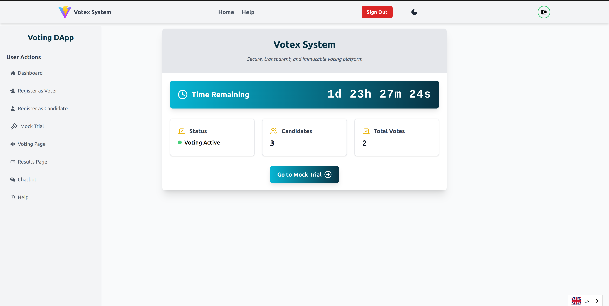

# Votex_System

Votex_Systems is a simple blockchain-based voting machine dApp designed for young individuals in under-served countries and regions. Our goal is to provide a secure and transparent voting experience that empowers communities and promotes civic engagement.

## Technologies Used

- **Vite**: A build tool that aims to provide a faster and leaner development experience for modern web projects.
- **Tailwind CSS**: A utility-first CSS framework for creating custom designs without having to leave your HTML.
- **Hardhat**: A development environment to compile, deploy, test, and debug your Ethereum software.
- **Solidity**: A programming language for writing smart contracts on the Ethereum blockchain.
- **Skale**: A blockchain network that provides a scalable and secure environment for decentralized applications.
- **JavaScript (JS & JSX)**: The programming languages used for building the frontend of the application.

## How the System Works

1. **Start Registration Period**: The admin must first start the registration period to allow people to start registering as voters.
2. **Add Positions**: The admin also has to add positions for candidates to register as candidates.
3. **Candidate Registration**: Candidates must first be registered voters before being allowed to register as candidates.
4. **Review Candidates**: The admin will be able to view and review all the registered candidates and can either approve or reject their candidature.
5. **Start Voting Period**: After reviewing candidates, the admin can start the voting period, which automatically stops the registration period.
6. **Voting**: Voters can now vote for the approved candidates.
7. **Votex ChatApp**: There is an in-system Votex ChatApp where logged-in and registered voters can chat with fellow voters, plan events, and more.

## Getting Started

To clone the repository and set up the project locally, follow these steps:

### Clone the Repository

```bash
git clone https://github.com/peter-mwau/Votex_System.git
```

### Install Dependencies

- Navigate to the project directory and install the required dependencies:

```bash
cd Votex_System
npm install
```

### Running the Project

- After installing the dependencies, you can run the project using:

```bash
npm run dev
```

### Deploying Your Own Smart Contract Instance

- If you wish to deploy your own instance of the smart contract, you will need to create a .env file in the root directory of the project and define the following environment variables:

```env
VITE_APP_CONTRACT_ADDRESS=your_contract_address
VITE_APP_PRIVATE_KEY=your_private_key
VITE_APP_RPC_URL=your_rpc_url
VITE_APP_BROCK_EXPLORER=your_brock_explorer_url
VITE_APP_FILESTORAGE_ENDPOINT=your_filestorage_endpoint
```

- You can obtain these details from the [SKALE Quick Start Guide](https://docs.skale.space/quick-start/deploy-to-testnet/).

### Preview

- This is how the Votex Dashboard looks like
  

### License

- This project is licensed under the MIT License.

### Contributing

- Feel free to contribute to this project by submitting issues or pull requests. Your feedback and contributions are welcome!
